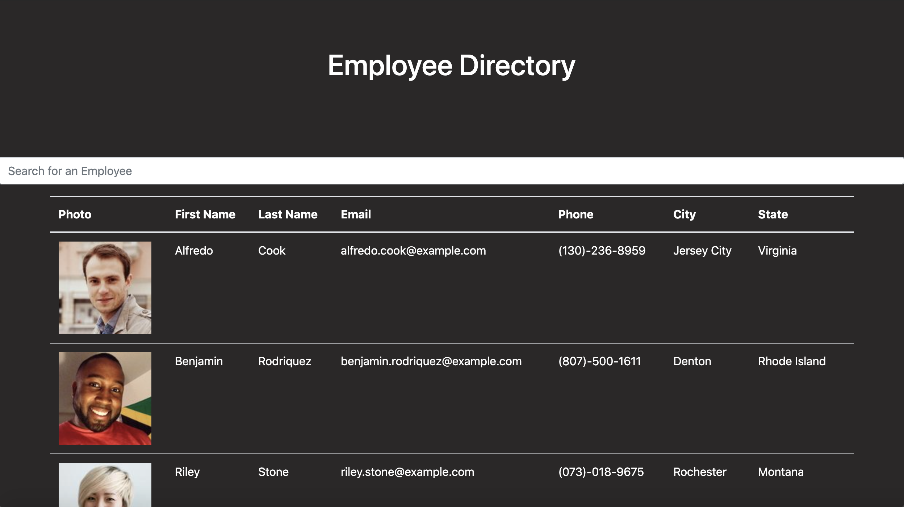

# employee_directory

  [](https://opensource.org/licenses/ISC)

  ## Description
  This application is an employee directory that allows a user to view the entire employee directory at once. The user is able to see the employees first name, last name, email, phone, and headshot.

  ## Table of Contents

  * [Description](#Description)
  * [Installation](#Installation)
  * [Usage](#Usage)
  * [License](#License)
  * [Questions](#Questions)

  ## Installation

  To install necessary dependencies, please run the following command:
  ```
  npm i axios, npm i bootstrap, npm i react, npm i react-dom
  ```

  ## Usage
  
  []
  
  [Deployed Application](https://alexhstrickland.github.io/employee_directory/)

  ## License
  This project is covered under the ISC license. Visit the following link for more information on this license: [ISC](https://opensource.org/licenses/ISC)
  

  ## Questions
  For any questions about the project, please contact me by either of the following links:
  
  * Email - alexhstrickland@gmail.com 
  
  or visit my GithHub profile
  
  * GitHub - [alexhstrickland](https://github.com/alexhstrickland)

